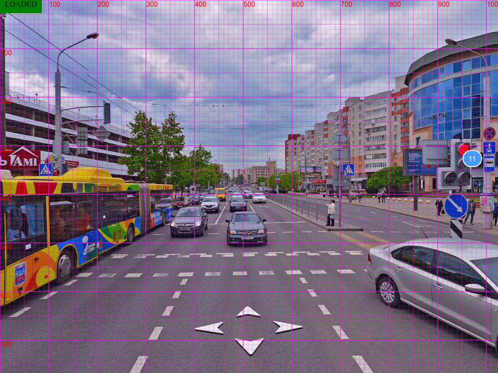

# Hermione тестирование
Процесс построен так, чтобы была возможность запустить тесты на текущей ревизии как локально, так и в CI. Для этого
поднимается дев-стенд (`npm run server`) и строится туннель (https://wiki.yandex-team.ru/users/unikoid/Tunneler/, необходим гриду,
но сделано единообразно и для локального запуска). Selenium можно поднять локально (`npm run local_selenium`), но предпочтительно
запускаться в гриде, там как минимум больший выбор браузеров и не нужно думать о том как эти браузеры дотянуть до CI и что там в итоге могут быть
другие картинки. Локальный selenium может быть полезен при разработке нового сценария, когда важно визуально отследить что происходит.

### Разработка нового теста
Рабочая папка всех манипуляций `./ui_tests/`.
Запускаем `npm run env`, пишем тест, отлаживаем командой `npm run update_refs tests/your_new_test.js`. Когда тест готов получаем скрины с грида:
гасим `npm run env` и запускаем `npm run grid_env`, затем `npm run grid_update_refs tests/your_new_test.js`. Полученные картинки коммитим вместе с тестом.

## Запуск тестов
CI настроен на запуск по ПР и коммитам в мастер. Отчет можно найти в гитхабовском чеккере **DEFAULT_JOB** **Details**, в Sandbox вкладка
**Resources**, в ресурсах **maps-front-panorama-test-report** нажимаем "глазик" и там index.html.

Локально запустить тесты можно `npm run grid_run_test`, отчет лежит в ./ui_tests/reports/index.html. Отдельный тест можно запустить если передать
переменную окружения `TEST`, например `TEST=path/to/test.js npm run grid_run_test`.

## Разработка тестов с взаимодействием
Особенность приложения, которая не позволяет писать тесты с взаимодействием (кликами по элементам, драгами и т.п.) привычным образом, состоит в том,
что часть контролов (стрелки переходов) рисуются прямо в канвасе и не существуют как DOM-элементы, а часть вообще не рисуется (области перехода шайбой).
Т.е. пользователь взаимодействует только с картинкой, а тест нужно написать в конкретных шагах, в частности, например, если нужно протестировать, что
по клику в определенном месте случился переход, то необходимо указать координаты клика.
Предлагается делать это следующим образом:
1. в приложении (`npm run server`) продумываем сценарий, например, "кликаем примерно в область левой фары красной тачки"
2. запускаем сценарий со специальной командой (`gridView`), чтобы понять координату этой "области левой фары"
3. добавляем шаг в тест (`clickPanorama(x, y)`)

Пример со всеми нюансами:
```js
    // обязательно выставляем фиксированный размер окна, т.к. в разных
    // браузерах размеры разные и координаты могут отличаться
    await browser.setViewportSize(1024, 768);

    // пишем часть сценария до взаимодействия
    await browser.openPanorama();
    await browser.execute(function() {
        window.engine.goto(27.578323581917072, 53.92208867366644);
    });
    await browser.waitUntilPanoramaLoaded();

    // временно получаем картинку с сеткой, чтобы выяснить координаты,
    // картинка сохраняется под именем tmp-for-grid-review.png,
    // после - удаляем эту строчку и картинку
    await browser.gridView();

    // полученные координаты используем дальше в сценарии
    await browser.clickPanorama(500, 640);
    ...
```

Так выглядит сетка:



## Проблемы

Гермиона не собирается свежим node.js (14+). В WSL собрать все получилось с `v10.17.0`, ее и можно использовать для надежности.

#### Не поднимается туннель (`npm run del_tunnel`)

```
[1] curl failed to verify the legitimacy of the server and therefore could not
[1] establish a secure connection to it. To learn more about this situation and
[1] how to fix it, please visit the web page mentioned above.
```

Для Ubuntu (и WSL). Скачиваем https://crls.yandex.net/allCAs.pem.

```sh
sudo cp allCAs.pem /usr/local/share/ca-certificates/YandexAllCAs.pem.crt
sudo update-ca-certificates
```

#### Не запускаются тесты локально в Windows

Запустить окружение (`npm run env`) локально и селениум на гриде возможно под WSL (см проблемы выше). Для запуске на локальном селениуме
можно использовать виртуалку с Ubuntu.
